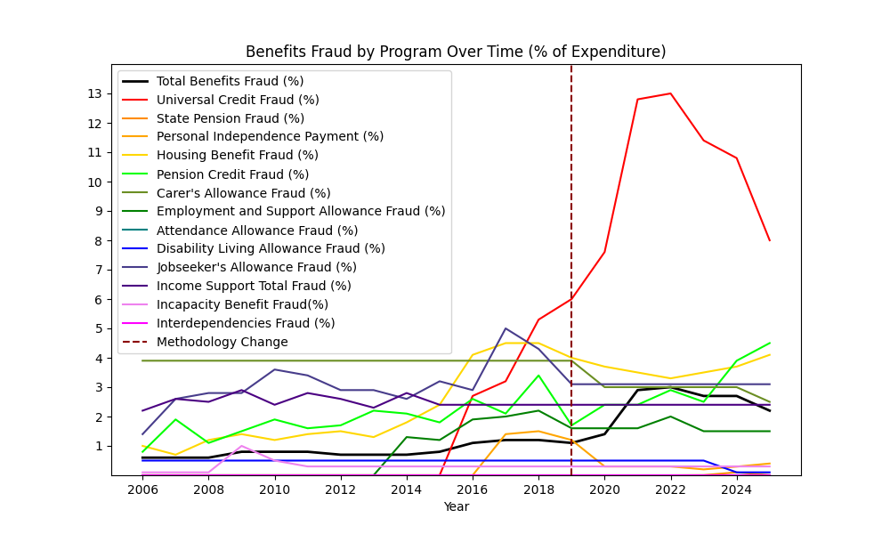
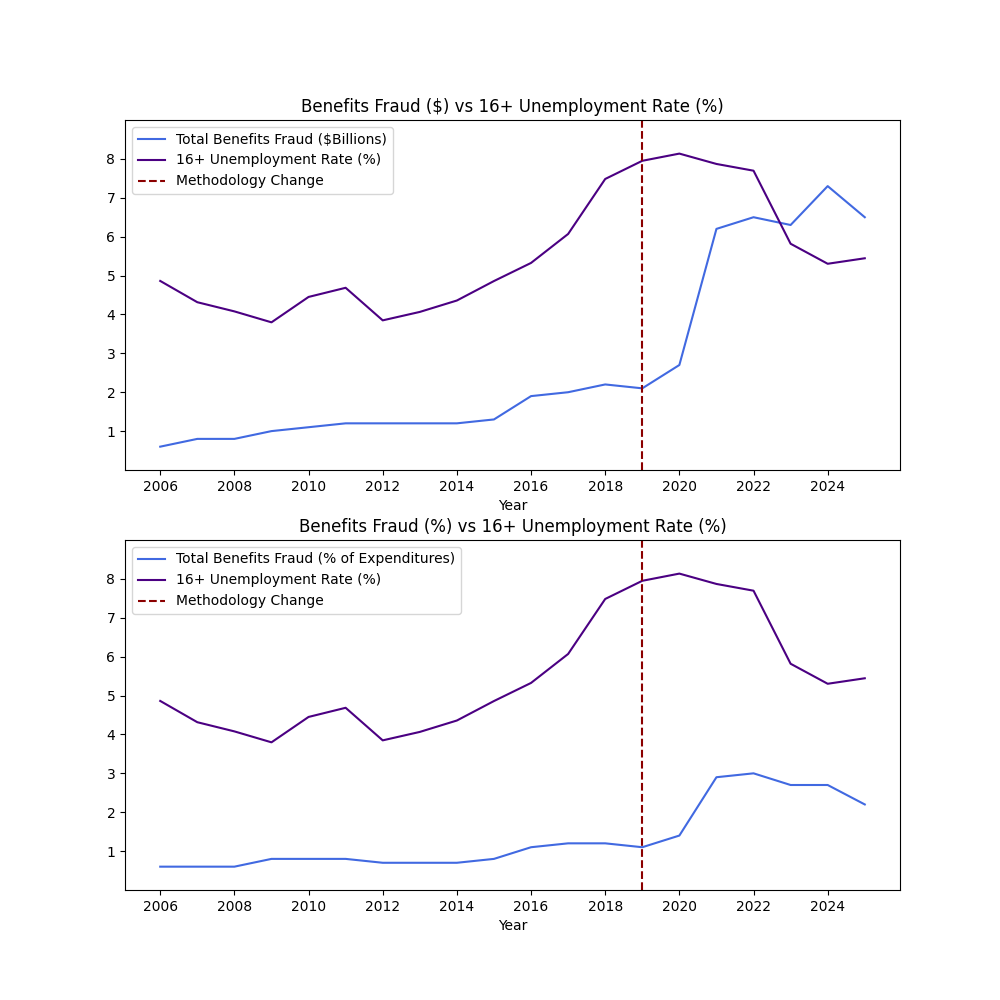
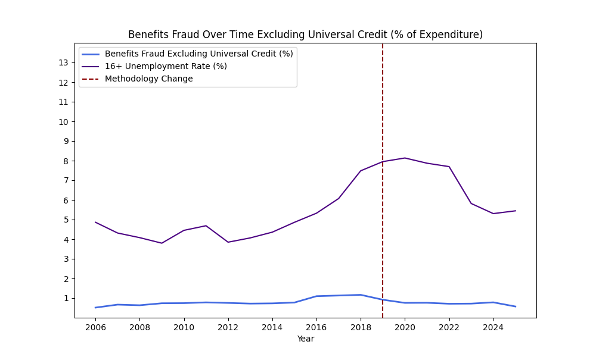

# Analysis of UK Benefits Fraud Against Unemployment

## Contributors

- Joshua Watson (ORCHID iD: 0009-0006-9195-9103)

- Michael Eannone

## Summary

[mention [structure.md](structure.md)]

## Data Profile

The first data set used in this project is the Department for Work and Pensions (DWP)'s [Fraud and Error in the Benefit System](https://www.gov.uk/government/statistics/fraud-and-error-in-the-benefit-system-financial-year-2024-to-2025-estimates) benefits fraud data. This is the official government data on benefits fraud and is available under the [Open Government Licence](https://www.nationalarchives.gov.uk/doc/open-government-licence/version/3/). The data was collected by taking a random sample of benefit claims to audit and determining the cause of any discrepancies as fraud, claimant error, or official error. The sample is then used to estimate total over/under payments and their causes in the form on a 95% confidence interval. The data can be found at `data/fraud_raw.xlsx`. The portion of data used in this report is the first two tables, which cover over/under payments broken down by program from 2006 to 2025. This will be the fraud data for our analysis in this report.

The second data set we will be using is UK Office of National Statistics (ONS)'s [Summary of Labour Market Statistics](https://www.ons.gov.uk/employmentandlabourmarket/peopleinwork/employmentandemployeetypes/datasets/summaryoflabourmarketstatistics). This is the official government data on the UK labor market and is also available under the [Open Government Licence](https://www.nationalarchives.gov.uk/doc/open-government-licence/version/3/). The data is from the ONS's Labour Force Survey, taken monthly since 1998. It contains data on unemployment rates, economic inactivity rates, and average pay rates broken down by sector and age groups. It can be found at `data/labour_raw.xls`. This report uses the unemployment data found on table one as the main economic indicator to compare benefits fraud against.

## Data Quality

### Accuracy

Given that the data is all numerical, we can be assured of syntactic accuracy in the fraud data. The fraud data was collected based on the DWP's audits of benefits claimants, which means that we cannot easily verify the accuracy of the data, as the individual audits are not public and we do not have the legal authority to conduct our own.

For the labor data, it too is all numerical, so syntactic accuracy is not a concern. Labor data is a much more heavily studied field than benefits fraud, so there are other independent surveys we could compare the data against. The data is collected via survey, so we can expect that some amount of people will lie, which could effect the accuracy of the data, especially given that people are more likely to lie to hide they are unemployed, so there probably isn't an equal amount of lying across all years. We could independently conduct our own survey to get 2026 data, but we would have to rely on existing data to verify past years.

### Completeness

The fraud data is rife with x's, w's, and z's representing data unavailable, no data found in sample, and not applicable, respectively. Unfortunately, 'x', which is the most ambiguous missing value, is also the most common. The reason for data labeled 'x' being missing can be for multiple reasons, as evidenced by Universal Credit. Universal Credit, a social security program, started in 2013 (Department for Work & Pensions), yet the data set is missing data from 2015 and earlier, with all years being labeled with just 'x'. Data before 2013 should be labeled as not applicable and we should consider 2013-2015 as missing, but there is no way to know that without outside research. This same issue applies to several other programs, making it hard to tell how truly complete the data is. Fortunately, 'w' clearly means the data is missing and thus incomplete and 'z' that the data is not applicable, which we can consider as complete. While not strictly missing, the fraud data for the Disability Living Allowance rounds to 0 every year, so in effect we have no data for it.

The labor data is complete in its entirety for all the data we are using, though it is missing data on labor disputes during the pandemic and some metrics have a year-on-year percent change that is missing because can't be calculate for for the first year data is collected.

### Consistency

Both data sets underwent changes in collection methodology. For the benefits fraud data, the data collection method changed in 2019 and how underpayments were classified changed in 2022. For this project, the 2022 change isn't relevant, but care should be taken went comparing data from before and after 2019. Most of the data is numerical, so the formatting is generally consistent, but for the x's, w's, and z's for missing values, sometimes characters were accidentally uppercase instead of the standard lowercase.

For the labor data, the data was re-weighted based on an updated population estimate in 2024. This change was retroactively applied to data from 2019 onward, but not to earlier years, with the ONS citing "time constraints". This change will also require us to be careful when using data from before and after 2019, which happens to correspond with the changes in the fraud data.

### Timeliness

The fraud data is overall very timely for this project as it has data as recent as 2025 and it published on an annual basis. It has data as far back as 2006, which will be useful for long term analysis. The only issue is that certain programs didn't exist for or otherwise don't have data for that full time period. The changes in collection methodology limits the utility of the more recent data, making that aspect of timeliness less impactful.

The labor data is published monthly and was updated in February 2026 with data up to December 2025, making it also very recent. The labor data goes as far back as 1971 for certain unemployment data, though most of the data only goes back to the 90s. Both of those are further back than the fraud data, so it will be plenty sufficient to compare 
with benefits fraud trends.

## Data Cleaning

To address the completeness issues in the fraud data set, we decided to treat the 'x' and 'z' missing entries as 0 and to impute data for 'w'. We chose to do this for 'z' because it represents "not applicable", most often because a program stop existing, and if a program doesn't exists it makes sense to consider it to no longer have any fraud. We also chose to do this for 'x' because it represented "not available", which most often meant that a program either hadn't started yet or had started but hadn't started reporting fraud data yet due to having recently started. In the first case, treating it as having no fraud makes sense since the program doesn't exist yet and in the second case we can't possible guess what the fraud level would have been, so we assume it is negligible for the first few years. For 'w', we chose to impute values because 'w' represented "no data found in the sample" and most often occurred in the middle of the life of a program when data was missing for given year. We decided to use K-Nearest-Neighbors with K=2 because this will impute the average of the two surrounding years, which seems like a reasonable estimate of the missing year.

In order to combine the fraud and labor data sets, we decided to convert the labor data from three-month rolling averages to year averages. Before, data was broken into January-March, February-April, and so on in overlapping periods, so we took the periods starting January through December each year and averaged them. The data set only had periods through October-December 2025, so the periods starting November and December 2025 were not able to be included in the 2025 average.

## Findings

In the above graph we see benefits fraud broken down by program as a percent of expenditures. In this graph, most programs saw a roughly stable level of fraud over the 19 year period with most rising a bit over time, however Universal Credit quickly spiked up after its inception especially in 2020-2023 during the COVID-19 pandemic. Universal Credit is also one of the biggest contributors to fraud in the dataset (80% of 2025's fraud), so we will analyze the data both including and excluding Universal Credit.

The above graph of total benefits fraud against unemployment shows that on both a dollar and percentage basis there is a clear positive relationship between unemployment and benefits fraud. For fraud dollars, using linear regression yielded a coefficient of 7.771*108 and a p-value of 0.026, which is statistically significant as an alpha level of 0.05. For fraud percentage, the coefficient was 0.3293 with a p-value of 0.007, which is also statistically significant. This causes us to conclude that there is a positive correlation between benefits fraud and unemployment.

Excluding Universal Credit from the data tells a different story. As shown in the above graph, the benefits fraud of all other programs combined is pretty stagnant over the entire 19 year period. A linear model fit to the data had a coefficient of 0.0417 and a p-value of 0.113, which is not statistically significant. This means that we cannot conclude based on our data that the fraud of programs other than Universal Credit correlates with unemployment at all at an alpha level of 0.05.

In summary, we found that there was a positive correlation between unemployment rate and benefits fraud, but the relationship was only statistically significant if Universal Credit was included in the data. We believe that this suggests that most benefits fraud may be due to willful theft rather than legitimate need on the part of the recipient, as most programs don't see a rise in fraud when economic conditions are worse, but Universal Credit in particular is at greater risk of fraud during worse labour markets. Though further testing would be needed to prove causality, this suggests that the DWP should reallocate its anti-fraud resources more towards Universal Credit during times of high unemployment. We also believe that this could be an indicator that Universal Credit provides insufficient aid such that fraud may be required for certain families to survive economic hard times, but this also requires further research. 

## Future Work

[potential future research]

[future test to prove causality]

## Challenges

Working around the excel format of the data was a major challenge. Especially for the fraud data, the excel sheets were formatted in a way that was nice for human readability, but which resulted in a lot of headaches and having to repeatedly make minor tweaks when mistakes were found. We used a different method for each dataset that matched its structure. For the fraud data we used pandas `read_excel` function and wrote code that was manually adapted to the structure due to various one-off visual markers in the data which were nice for human readability but annoying for machine readability. 

Because the labor data was already formatted in uninterrupted tables, we used xlrd and regular expressions to parse the data automatically from each sheet. The challenge with the labor data was that it was spread across 28 sheets and each one was formatted differently. Some of the sheets had multiple header rows stacked on top of each other, some stored dates as numbers instead of readable text, and others had footnote text mixed in with the actual data rows. In order to handle all of this without writing completely separate code for every sheet, a parser that could be adjusted depending on the sheet was built. 5 sheets ended up being left out entirely, with 3 only having metadata text and the other 2 had their data removed by ONS and moved to a different dataset.

Another challenge we dealt with was deciding how to deal with the large quantity of missing values in the fraud data. The details of this are discussed in the Data Cleaning section of this report, but we ultimately decided to impute the truly missing data and treat the intentionally missing data as 0.

Another challenge in this project was that we initially wrote the project in a jupyter notebook for easy debugging. Once we got late in the project, we had to convert the jupyter notebook to multiple Python scripts and a Snakefile. This required some minor retooling, as the code had to account for having to load and save the data before each step, but ended up being a good opportunity to winnow some unnecessary code.

Another challenge in this project was figuring out how to best display the data. For graphs, this was pretty simple, but we wanted to have linear regression output. When we initially wrote the project in a jupyter notebook, the statsmodel output could simply be printed, but we had to be more creative in the Snakemake version. We ultimately opted for simply writing the output to a text file. We would like it to have been some kind of image instead, but we considered the text file a sufficient solution.

## Reproducing

The dependencies for this project are the python packages found in `dependencies.txt`. They can be installed with `pip install -r dependencies.txt`.

To reproduce the results of this project from scratch, run `snakemake -c 1 --delete-all-output` to remove all existing files and then run `snakemake -c 1` to run all scripts in the project.

Contains public sector information licensed under the [Open Government Licence v3.0](https://www.nationalarchives.gov.uk/doc/open-government-licence/version/3/).

All source code is under [BSD 2-clause license](LICENSE).

## References

Department for Work and Pensions. (8 May 2015). *2010 to 2015 government policy: welfare reform*. GOV.UK. https://www.gov.uk/government/publications/2010-to-2015-government-policy-welfare-reform/2010-to-2015-government-policy-welfare-reform#appendix-1-government-policy-on-universal-credit-an-introduction

Department for Work and Pensions. (12 June 2025). *Fraud and error in the benefit system: Financial year 2024-2025 estimates* [Data set]. GOV.UK. https://www.gov.uk/government/statistics/fraud-and-error-in-the-benefit-system-financial-year-2024-to-2025-estimates

Office for National Statistics. (19 March 2026). *A01: Summary of labour market statistics* [Data set]. GOV.UK https://www.ons.gov.uk/file?uri=/employmentandlabourmarket/peopleinwork/employmentandemployeetypes/datasets/summaryoflabourmarketstatistics/current/a01mar2026.xls